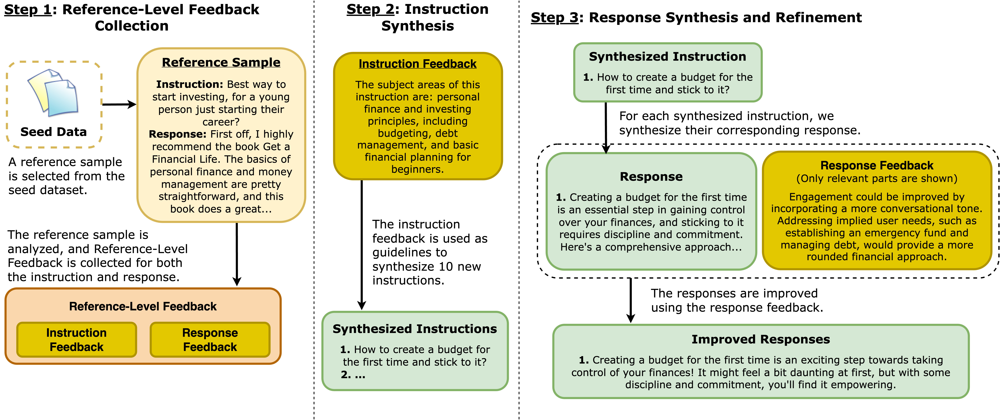

# Beyond Sample-Level Feedback: Using Reference-Level Feedback to Guide Data Synthesis

[](https://arxiv.org/abs/2502.04511)

This repository contains the code for [Beyond Sample-Level Feedback: Using Reference-Level Feedback to Guide Data Synthesis](https://arxiv.org/abs/2502.04511), including the [REFED dataset](#refed-dataset) and complete [source code](#reference-level-feedback-guided-data-synthesis) for synthesizing data with our framework.

## Overview

We present <span style="font-variant: small-caps;">Reference-Level Feedback</span>, a novel paradigm for data synthesis that leverages feedback from high-quality reference samples to synthesize instruction-following data. Our method explicitly captures desirable characteristics from reference samples through feedback and uses it to guide the synthesis process. This results in higher quality synthetic data that better reflects the desired attributes of the reference samples.

Our framework is illustrated below:




## Reference-Level Feedback Guided Data Synthesis

## Installation

1. Clone the repository:
```bash
git clone https://github.com/Shuhaibm/refed
cd refed
```

2. Create and activate a virtual environment (recommended):
```bash
python -m venv env
source env/bin/activate
```

3. Install dependencies:
```bash
pip install -r requirements.txt
```

### Environment Setup

Before running the data synthesis, set up your Azure OpenAI credentials:

```bash
export AZURE_OPENAI_KEY=<azure-key>
export AZURE_ENDPOINT=<azure-endpoint>
export AZURE_VERSION=<azure-api-version>
```


### Command Line Arguments

The main generation script (`generate.py`) supports the following arguments:

- `--teacher_model`: Model for feedback collection and synthesis
- `--seed_dataset_name`: Seed dataset name
- `--size`: Number of samples to generate
- `--output_dir`: Output directory

### Usage Example

```bash
python3 generate.py \
    --teacher_model gpt-4o-mini \
    --seed_dataset_name GAIR/lima \
    --size 10000 \
    --output_dir ./output_dir
```


Synthesized data samples will follow this format:
```
{
    "instruction": str,
    "response": str,
    "analysis": {
        "original_strengths": list[str],
        "improvement_opportunities": list[str],
        "relevant_feedback": list[str]
    },
    "implementation_strategy": {
        "planned_changes": list[str],
        "rationale": str
    },
    "improved_response": str
}
```

## REFED Dataset

<span style="font-variant: small-caps;"><strong>RE</strong>ference-Level <strong>F</strong>eedback <strong>E</strong>nhanced <strong>D</strong>ata</span> (<span style="font-variant: small-caps;">REFED</span>) is our dataset synthesized using the reference-level feedback framework. Using gpt-4o-mini as the teacher model and the LIMA training dataset (1K samples) as reference data, we synthesized this dataset for less than $20. The dataset is available at [./data/refed.json](./data/)

<strong>Usage and License Notices</strong>: REFED is intended and licensed for research use only. The dataset is CC BY NC 4.0 (allowing only non-commercial use) and models trained using the dataset should not be used outside of research purposes.

## Citation

```bibtex
@misc{mehri2025samplelevelfeedbackusingreferencelevel,
      title={Beyond Sample-Level Feedback: Using Reference-Level Feedback to Guide Data Synthesis}, 
      author={Shuhaib Mehri and Xiusi Chen and Heng Ji and Dilek Hakkani-Tür},
      year={2025},
      eprint={2502.04511},
      archivePrefix={arXiv},
      primaryClass={cs.CL},
      url={https://arxiv.org/abs/2502.04511}, 
}
```